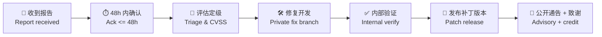

# 安全策略 | Security Policy

> **报告漏洞 | Report a Vulnerability**: [创建私密安全通告 Open a private security advisory](https://github.com/YYC-Cube/YYC3-AI-Family-API-Console/security/advisories/new) 或邮件 **sec@0379.email**
> **公开渠道 | Public channel**: 请勿在 Issue/PR 中披露未修复的漏洞 Do not disclose unfixed vulnerabilities in public issues.

## 支持版本 | Supported Versions

| 版本 Version | 支持状态 Status | 安全补丁 Security Fixes |
|--------------|----------------|:---:|
| latest (`main` / 最新 Release) | ✅ Full | ✅ |
| 前 1 个 minor（如 `N-1`） | ✅ Maintenance | ✅ |
| 更早版本 Earlier | ❌ EOL | ❌ |

## 报告内容 | What to Include

1. 漏洞类型与影响面 Vulnerability type & impact scope
2. 复现步骤（含最小 PoC，请脱敏）Repro steps (minimal, sanitized PoC)
3. 受影响版本 / 提交 Affected versions / commit SHA
4. 修复建议（如有）Suggested fix if any

## 响应流程 | Response Process

| 阶段 Stage | 目标时限 Target SLA |
|-----------|-------------------|
| 确认收到 Acknowledgement | ≤ 48 小时 hours |
| 初步评估 Initial assessment | ≤ 7 天 days |
| 高危修复 High-severity fix | ≤ 30 天 days |
| 公开通告 Public disclosure | 补丁发布后 90 天内 within 90 days after patch |

## 严重度处理 | Severity Handling

| CVSS | 处置 Handling |
|------|--------------|
| 9.0-10.0 Critical | 立即应急：冻结发布窗 + 热修 + 全员通告 Immediate hotfix, freeze, broadcast |
| 7.0-8.9 High | 30 天内补丁，扫描器自动建 Issue 指派 sec@ Patch in 30d, auto-issue to sec@ |
| 4.0-6.9 Medium | 下一例行版本 Next regular release |
| 0.1-3.9 Low | 积压清单 Backlog |

## 安全编码基线 | Secure Coding Baseline

- 密钥/凭证仅经环境变量注入（`VITE_*` 前缀变量会进入客户端产物，**严禁**放置私密密钥），仓库内零硬编码（gitleaks 闸强制）
  Secrets via env only; `VITE_*` vars are bundled into client output — never store private keys there. Zero hardcoding enforced by gitleaks gate.
- API 令牌（如 `VITE_FAMILY_BUS_TOKEN`）遵循最小权限 + 定期轮转
  API tokens follow least-privilege + periodic rotation
- CI 供应链安全：pnpm lockfile 冻结 + Trivy HIGH/CRITICAL 扫描 + Dependabot 建议
  Supply-chain security: frozen lockfile + Trivy scans + Dependabot
- 内容三级过滤与零信任架构约定见 [docs/ARCHITECTURE.md](./docs/ARCHITECTURE.md)
  3-tier content filter & zero-trust conventions in Architecture doc

---

**® YANYUCLOUDCUBE** · © 2025-2026 言语（河南）智能科技有限公司 · Yanyu Intelligent Technology Co., Ltd.

