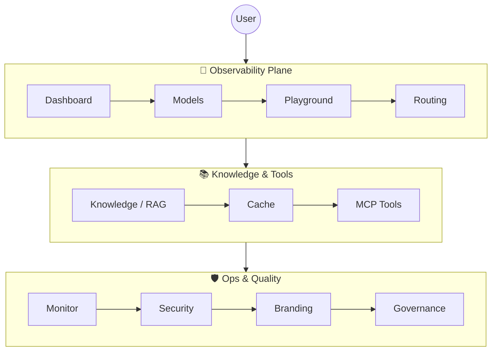

<div align="center">


# YYC³ · AI Family Token Console

### 统一模型网关 · 可观测 · 可调试

### Unified Model Gateway · Observable · Debuggable

**® YANYUCLOUDCUBE** · **言语（河南）智能科技有限公司**
**Yanyu Intelligent Technology Co., Ltd.**

[](./LICENSE)
[](./CHANGELOG.md)
[](./.github/workflows/ci.yml)
[](./public/manifest.webmanifest)
[](./public/yyc3-icons/iOS/App%20Store.png)
[](./public/yyc3-icons/Android/Play%20Store.png)
[](./public/yyc3-icons/macOS/1024.png)
[](./public/yyc3-icons/watchOS/App%20Store.png)

*言启千行 | 语枢万物智能*
*Words Initiate Quadrants, Language Serves as Core for the Future*

*万象归元于云枢 | 深栈智启新纪元*
*All things converge in cloud pivot; Deep stacks ignite a new era of intelligence*

</div>

---

## 📖 项目简介 · Introduction

> **YYC³ AI Family Token Console** 是 YanYuCloudCube 出品的**统一模型网关·可观测·可调试·八智能体协同控制台**——
> 一座把多源模型、多端适配、可观测数据、AI 家族成员协作统一在同一控制面的智能中枢。

A unified **model gateway + observability + debugger + eight-agent family console** crafted by YanYuCloudCube — one pane of glass for multi-source models, cross-end adaptation, real-time telemetry, and the AI Family collaboration.



---

## ✨ 核心特性 · Core Features

| # | 中文 | English |
| --- | ------ | --------- |
| 1 | **统一模型网关**：GLM-4 / DeepSeek-V3 / Qwen2.5 / Llama-3.3 / Claude-3.5 一键切换 | **Unified Gateway**: One-click routing across GLM-4 / DeepSeek-V3 / Qwen2.5 / Llama-3.3 / Claude-3.5 |
| 2 | **AI-Family 八智能体**：智云/言启/语枢/预见/知遇/智云/格物/创想 · BaseAgent 契约 | **AI-Family Eight Agents**: contract-driven via `BaseAgent` |
| 3 | **可观测可调试**：实时 SSE 推理流 · 路由追踪 · 质量脉冲 | **Observable & Debuggable**: SSE streaming · route tracing · quality pulse |
| 4 | **协议栈标准化**：MCP 工具连接 + RESTful v1 端点 + FamilyBus | **Standardized Protocols**: MCP tool connectivity + RESTful v1 + FamilyBus |
| 5 | **全栈可观测**：结构化日志 · SLO 错误预算 · W3C Trace 分布式追踪 | **Full-stack Observability**: structured logs / SLO error budgets / W3C distributed tracing |
| 6 | **安全合规治理**：零信任架构 · 内容三级过滤 · 密钥端侧保护 | **Zero Trust + 3-tier Content Filter + Client-side Key Protection** |
| 7 | **PWA 全端适配**：iOS / Android / macOS / watchOS / Web 五端原生安装体验 | **PWA Multi-Platform**: installable on iOS / Android / macOS / watchOS / Web |
| 8 | **五维驱动架构**：时间维·空间维·属性维·事件维·关联维 全链路贯通 | **Five-Dimensional Drive**: time / space / attribute / event / association |

## 🛡️ PWA 全端矩阵 · Multi-Platform Matrix

| 平台 | 安装入口 | manifest 声明 | 图标源 |
| ------- | ------- | -------- | ------- |
| **iOS** | Safari → 分享 → 添加到主屏幕 | `apple-touch-icon` × 9 尺寸 | `yyc3-icons/iOS/` |
| **Android** | Chrome → 安装应用 | `manifest.icons` + `maskable` | `yyc3-icons/Android/` |
| **macOS** | Safari → 文件 → 添加到 Dock | `display_override` + apple-touch-icon | `yyc3-icons/macOS/` |
| **watchOS** | iPhone Watch App | iOS 体系继承 | `yyc3-icons/watchOS/` |
| **Web** | 浏览器地址栏安装 | `manifest.webmanifest` | `yyc3-icons/Web App/` |

详见：[docs/yyc3-icon-system-design.md](./docs/yyc3-icon-system-design.md)

## 🚀 快速开始 · Quick Start

### 前置依赖 · Prerequisites

| 依赖 | 版本 | 用途 |
| ----- | ----- | ----- |
| Node.js | 18+ | 运行时 |
| pnpm | 8+ | 包管理（推荐） |
| npm | 9+ | 备选包管理 |

> **端口约定**：`3030+`（YYC³ 团队规范）
> 本项目默认监听 **`3030`**，可通过环境变量 `PORT` 覆盖。

### 安装与启动

```bash
# 1) 克隆仓库
git clone https://github.com/YYC-Cube/YYC3-AI-Family-API-Console.git
cd YYC3-AI-Family-API-Console

# 2) 安装依赖（推荐 pnpm）
pnpm install      # 或 npm install / yarn install

# 3) 启动本地开发服务器
pnpm dev          # 或 npm run dev  → http://localhost:3030

# 4) 生产构建预览
pnpm build && pnpm preview  #  → http://localhost:3030
```

### 环境变量

```bash
# .env.local（按需创建，**不入库**）
PORT=3030                 # 开发服务器端口（默认 3030）
VITE_API_BASE=/v1         # 后端 API 基础路径
VITE_FAMILY_BUS_TOKEN=... # FamilyBus 连接令牌（可选）
```

### 验证清单 · Smoke Tests

```bash
# 1) 根路径返回 200
curl -s -o /dev/null -w "%{http_code}" http://localhost:3030/
# 期望: 200

# 2) 关键资源全部可达
for path in \
  /yyc3-icons/Web%20App/android-chrome-192.png \
  /yyc3-icons/macOS/1024.png \
  /yyc3-icons/iOS/iPhone%20App%203x.png \
  /manifest.webmanifest \
  /sw.js \
  /favicon.ico \
  /browserconfig.xml \
  /robots.txt \
  /sitemap.xml \
  /.well-known/security.txt \
  /.well-known/apple-app-site-association \
  /.well-known/assetlinks.json \
  /banner.png \
  /og-image.png \
  /offline.html
do
  code=$(curl -s -o /dev/null -w "%{http_code}" "http://localhost:3030${path// /%20}")
  echo "$code  ${path}"
done
# 期望: 每行 200
```

## 📁 目录结构 · Repo Layout

```
public/
├── banner.png                      ← README 顶图（原尺寸 1024×1024）
├── og-image.png                    ← 社交分享卡（1200×630 兼容尺寸）
├── favicon.ico / favicon.svg       ← 浏览器通用图标
├── browserconfig.xml               ← Windows 磁贴配置
├── manifest.webmanifest            ← PWA 主清单（全端 icons）
├── robots.txt / sitemap.xml        ← SEO 元文件
├── offline.html                    ← 离线兜底页
├── sw.js                           ← YYC³ 五维驱动 Service Worker
├── yyc3-Family.png                 ← 家族主视觉（pink/gold/white 三套）
└── yyc3-icons/                     ← 多端图标矩阵
    ├── Android/    (mdpi → xxxhdpi + Play Store)
    ├── Web App/    (favicon-16/32 + apple-touch + android-chrome)
    ├── iOS/        (App Store + iPhone/iPad 全场景)
    ├── macOS/      (16/32/64/128/256/512/1024)
    └── watchOS/    (App Store + Home + Notification + Short Look)
src/
├── App.tsx                         ← 八智能体路由控制
├── main.tsx                        ← 入口
├── config/branding.ts              ← 品牌配置 (defaultBranding + LS 持久化)
├── lib/api.ts                      ← /v1 RESTful 客户端
├── data/modelAssets.ts             ← 模型资产清单
├── imports/                        ← 静态资源 (logoCyan/logoGold/logoWhite)
└── index.css                       ← Tailwind v4 + 全局样式
.figma/make/site.json               ← Vite 配置注入源（必需）
.github/workflows/                  ← CI/CD 流水线
docs/yyc3-icon-system-design.md     ← 图标可视化体系设计文档
```

## ⚙️ CI/CD · Pipeline

工作流定义位于 [`.github/workflows/`](./.github/workflows/)：

| 工作流 | 触发 | 内容 |
| ------ | ------- | -------- |
| `ci.yml` | push / PR to main、develop | TypeScript 编译 + Lint + 安全扫描 + Playwright (a11y/visual) + Lighthouse + 失败告警 |
| `a11y.yml` | `src/**` / `e2e/**` 变更 | axe-core WCAG 2.2 AA 门禁（serious/critical 阻断合并） |
| `visual.yml` | `src/**` 视觉相关变更 | 32 快照回归（12 路由 × dark/light + 8 徽章 + 2 组件） |
| `contract.yml` | `api.ts` / `contracts/**` + 每日巡检 | OpenAPI sha256 契约漂移检测（漂移阻断） |
| `release.yml` | tag `v*.*.*` | 版本门禁 → 制品构建 → GH Release → 通知 |
| `docs.yml` | push / PR（`docs/**`、`**.md`） | Markdown lint + 死链扫描 + Frontmatter 校验（纯校验） |
| `deploy.yml` | push to `main`（src/public 变更） | 质量门禁 → Vite 构建 → **GitHub Pages 自动部署 → [token.yyc3.top](https://token.yyc3.top)** |

完整流水线说明见 [docs/CICD.md](./docs/CICD.md)。

## 🧪 测试 · Testing

```bash
pnpm test:e2e         # Playwright a11y 全链路
pnpm test:visual      # Playwright visual 回归
pnpm test:visual:update  # 视觉基线更新（当 UI 变更时执行）
```

`e2e/reports/html/` 与 `e2e/visual.spec.ts-snapshots/` 提供历史报告与基线。

## 🛠️ 开发规范 · Conventions

遵循 [YYC³ 团队通用 - AI 协同开发文档](./docs/YYC3-AI-Family-Token-Console-团队规范/标规文档/YYC3-团队通用-开发文档.md) 五维驱动核心理念：

- **五高**：高可用 · 高性能 · 高安全 · 高扩展 · 高智能
- **五标**：标准化 · 规范化 · 自动化 · 可视化 · 智能化
- **五化**：流程化 · 数字化 · 生态化 · 工具化 · 服务化
- **五维**：时间维 · 空间维 · 属性维 · 事件维 · 关联维

图标、跨端适配详见：[docs/yyc3-icon-system-design.md](./docs/yyc3-icon-system-design.md)

## 🤝 协作与标签 · Collaboration & Labels

| 文档 | 用途 |
| ---- | ---- |
| [.github/CONTRIBUTING.md](./.github/CONTRIBUTING.md) | 贡献指南（分支模型 / Commit 规范 / PR 检查单） |
| [docs/LABELS.md](./docs/LABELS.md) | **仓库标签体系设计**：类型 × 智能体域 × 优先级 × 状态四轴治理 |
| [.github/labels.json](./.github/labels.json) | 标签机器可读清单（33 标签，八智能体域色板对齐 UI 主题色） |
| [.github/SECURITY.md](./.github/SECURITY.md) | 安全策略与漏洞报告私密渠道 |
| [docs/index.md](./docs/index.md) | 全套开发者文档导航（架构 / CI/CD / 规范映射 / 开发指南） |

## 📜 许可证 · License

```
Copyright © 2025-2026 YanYuCloudCube Team.
Licensed under the Apache License, Version 2.0.
```

---

<div align="center">

> 「***YanYuCloudCube***」
> 「***<admin@0379.email>***」
> 「***Words Initiate Quadrants, Language Serves as Core for the Future***」
> 「***All things converge in cloud pivot; Deep stacks ignite a new era of intelligence***」

**© 2025-2026 YanYuCloudCube™. All Rights Reserved.**

</div>
