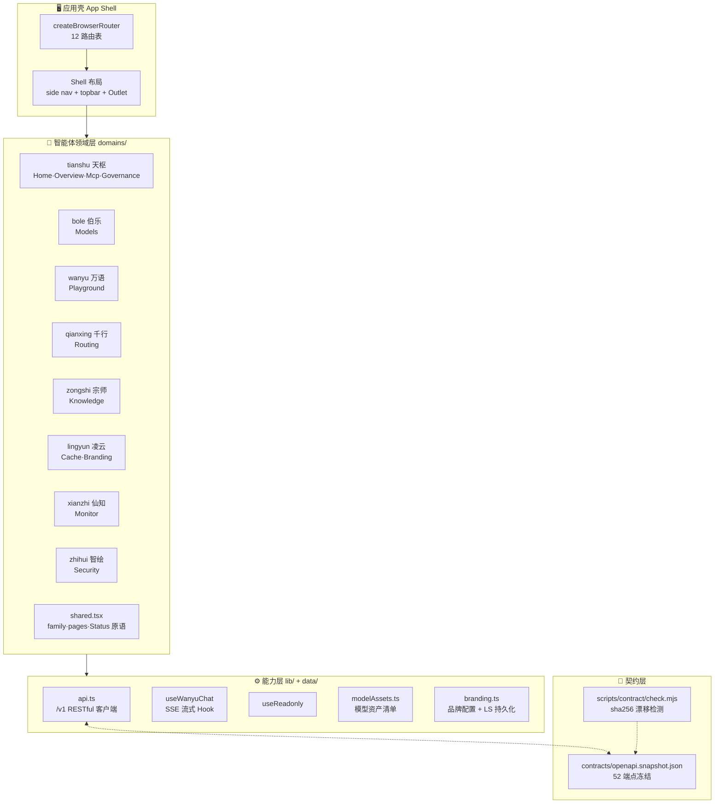
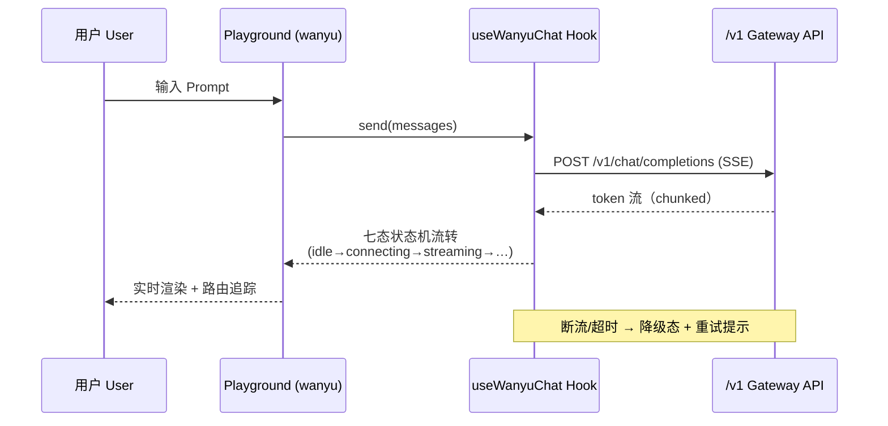

# 架构总览 | Architecture Overview

> *言启象限 | 语枢未来* — 维护者 docs@0379.email

## 一、技术栈全景 | Tech Stack

| 层级 | 技术 | 版本 | 用途 |
| ---- | ---- | ---- | ---- |
| UI 框架 | React | 19 | 组件化渲染（StrictMode） |
| 路由 | react-router | 8.4 | `createBrowserRouter` 数据路由 |
| 构建 | Vite | 8 | Dev server + 生产构建（端口 3030） |
| 样式 | Tailwind CSS | 4 | `@tailwindcss/vite` 原生集成 |
| 语言 | TypeScript | 5.7+ | `strict: true` 全量类型安全 |
| 格式化 | oxfmt | 0.2 | Rust 级格式化（CI 门禁） |
| E2E | Playwright | 1.55 | a11y + visual 回归 |
| 可访问性 | axe-core | 4.10 | WCAG 2.2 AA 门禁 |
| 包管理 | pnpm | 11（Corepack 锁定） | `--frozen-lockfile` 唯一真值 |
| PWA | manifest + SW | — | 五端安装矩阵 |

## 二、应用分层 | Layered Architecture



## 三、关键设计决策 | Key Design Decisions

| 决策 Decision | 选择 Choice | 理由 Rationale |
|---------------|------------|----------------|
| 路由架构 | react-router 8 `createBrowserRouter`（非 Next.js） | 纯前端控制台 + Figma Make 导出管线兼容；SSR 需求由网关侧承担 |
| 领域组织 | 按八智能体分域（`src/domains/`） | 智能体即模块边界，协作契约经 `shared.tsx` 单点收敛 |
| 契约治理 | OpenAPI 快照 + sha256 规范化 | 前后端解耦开发，漂移即阻断（[contract.yml](../.github/workflows/contract.yml)） |
| 流式推理 | SSE（`useWanyuChat`） | 单向推送天然匹配 LLM token 流，七态状态机可观测 |
| 状态持久化 | localStorage（branding） | 零后端依赖的品牌定制，跨会话保留 |
| 服务 Worker | 原生 `sw.js`（非 Workbox） | 五维驱动定制缓存策略，体积最小化 |
| 端口规范 | 3030（团队规范 3030 起） | YYC³ 标准化强制项，`PORT` 可覆盖 |

## 四、数据流 | Data Flow



## 五、目录结构 | Directory Layout

```
├── src/
│   ├── App.tsx                  ← 路由表 + Shell（12 路由）
│   ├── main.tsx                 ← 入口 + SW 注册
│   ├── domains/                 ← 八智能体领域组件
│   ├── lib/                     ← api.ts / useWanyuChat / useReadonly
│   ├── data/modelAssets.ts      ← 模型资产清单
│   ├── config/branding.ts       ← 品牌配置（defaultBranding + LS）
│   └── imports/                 ← 静态 logo 资源
├── contracts/openapi.snapshot.json  ← 52 端点契约冻结
├── scripts/contract/check.mjs   ← 漂移检测门禁
├── e2e/                         ← a11y / visual 基线（32 快照）
├── public/                      ← PWA 图标矩阵 / manifest / sw
└── .github/workflows/           ← 五闸 CI/CD
```

## 六、可观测性约定 | Observability

- **结构化追踪**：路由切换 → topbar 面包屑（`YYC³ / ROUTE`）
- **健康态**：侧栏 `Status` 组件 awaiting `/healthz`（联动网关健康检查）
- **质量脉冲**：首页 LIVE 拓扑（视觉基线 `threshold: 0.12` 容忍动态发光）
- **SLO 错误预算**：监控域 `xianzhi-monitor` 承载，契约对齐 `/v1/monitor/*`

---

<div align="center">**® YANYUCLOUDCUBE** · © 2025-2026 言语（河南）智能科技有限公司</div>
