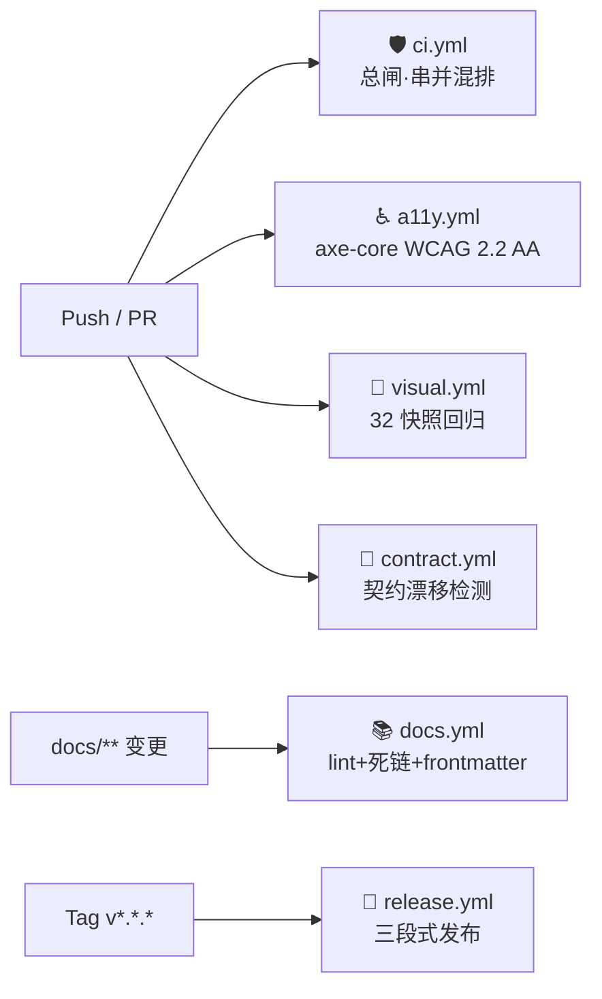

# CI/CD 流水线 | CI/CD Pipeline

> _执行有规划，规划有节点，节点有目标，目标可评估_

## 一、五闸全景 | Five Gates Overview



## 二、ci.yml — 总闸流水线

| Job                 | 内容                                       | 失败处置                                    |
| ------------------- | ------------------------------------------ | ------------------------------------------- |
| `install`           | pnpm `--frozen-lockfile`（锁文件唯一真值） | 锁文件漂移 → 本地重跑 `pnpm install` 提交锁 |
| `typecheck`         | `tsc --noEmit`（strict）                   | 类型错误零容忍                              |
| `lint`              | `pnpm format --check`（oxfmt ≥0.68 官方版；⚠️ 历史上误装同名损坏包 0.2.0 会破坏 TS 语法，已升级根治） | 格式化后提交 |
| `security-scan`     | gitleaks + Trivy HIGH/CRITICAL             | 泄密立即轮转密钥；漏洞升级依赖或加抑制      |
| `build`             | Vite 生产构建 + dist 产物上传（14 天）     | —                                           |
| `e2e-a11y`          | Playwright a11y 全链路                     | 报告见 Artifacts `e2e-reports`              |
| `visual-regression` | 12 路由 × dark/light + 徽章基线            | 预期变更 → `pnpm test:visual:update` 重冻结 |
| `lighthouse-pwa`    | 五类审计（PWA/性能/a11y/最佳实践/SEO）     | 报告参考型，暂不阻断                        |
| `notify`            | failure 聚合告警（<admin@0379.email>）     | 可选 Webhook（Secrets.WEBHOOK_URL）         |

依赖编排：`install → {typecheck, lint, security} → build → {e2e, visual, lighthouse} → notify`

## 三、专项门禁 | Specialized Gates

### ♿ a11y.yml — 可访问性门禁

- 标准：WCAG 2.2 AA（`wcag2a/2aa/21aa/22aa`）
- 阻断条件：`serious` 或 `critical` 违规 > 0
- 范围：`/dashboard` `/models` `/playground` `/monitor` `/branding` 五路由 axe 扫描
- 触发：`src/**`、`e2e/**`、`playwright.config.ts` 变更

### 🎨 visual.yml — 视觉基线门禁

- 基线：`e2e/*.spec.ts-snapshots/`（随仓库提交，Linux CI 渲染一致）
- 审阅流程：diff 报告（Artifacts `visual-diff`）→ 预期变更则 `pnpm test:visual:update` 冻结并提交；非预期 → 检查 CSS/布局/字体

### 📜 contract.yml — 契约漂移门禁

- 机制：`https://api.0379.world/openapi.json` 实况 sha256（规范化后）vs `contracts/openapi.snapshot.json`
- 漂移处置：复核 `src/lib/api.ts` 类型同步 + 受影响页面（Dashboard/Routing/Cache/Playground）→ 确认兼容后 `pnpm contract:freeze`
- 巡检：每日 02:00 UTC 定时被动发现线上漂移

## 四、docs.yml — 文档流水线（纯校验）

> Pages 部署职责已移交 [deploy.yml](../.github/workflows/deploy.yml)——Pages 单站点仅允许一个部署方，**应用 dist 为唯一站点主体**（<https://token.yyc3.top）。>

| 步骤             | 工具                   | 说明                                                           |
| ---------------- | ---------------------- | -------------------------------------------------------------- |
| Markdown lint    | markdownlint-cli2      | 配置见 [.markdownlint-cli2.jsonc](../.markdownlint-cli2.jsonc) |
| 死链扫描         | lychee（offline 模式） | 站内相对链接零死链                                             |
| Mermaid 校验     | mmdc（可用时）         | 图表语法防呆                                                   |
| Frontmatter 校验 | python3 内联           | 标规必填字段防呆                                               |

## 四.5、deploy.yml — 生产部署流水线

```
push main（src/public/config 变更）或手动
  → quality-gate（pnpm 冻结安装 → tsc strict → vite build → cp 404.html SPA 回退 → dist 冒烟: CNAME/manifest/sw/canonical 域名）
  → configure-pages + upload-pages-artifact
  → deploy（actions/deploy-pages → environment github-pages，url = https://token.yyc3.top）
  → post-deploy（域名探针: / · /manifest.webmanifest · /offline.html，非阻断）
```

要点：

- **域名**：`public/CNAME`（token.yyc3.top）随 dist 发布；需 Settings → Pages → Custom domain 一致
- **SPA 回退**：react-router BrowserRouter 深链刷新经 `404.html` 兜底
- **concurrency group: pages + cancel-in-progress: false**：部署串行不互踩

## 五、release.yml — 发布流水线

```
tag v*.*.* 推送
  → verify（tsc + format + build 三重门禁）
  → release-build（dist 产物 30 天留存）
  → release-publish（Changelog 生成 + GitHub Release + dist 附件）
  → release-notify（成败双通告）
```

版本纪律：与 [CHANGELOG.md](../CHANGELOG.md) 对齐；`workflow_dispatch` 支持手动指定版本号。

## 六、本地对齐 | Local Parity

本地门禁与 CI 同款，入口统一 Makefile：

```bash
make check        # lint + typecheck（对应 ci 前 3 闸）
make build        # 生产构建
make test-e2e     # a11y 全链路
make test-visual  # 视觉回归
make contract     # 契约漂移检测
```

## 七、Secrets 清单 | Required Secrets

| Secret         |   必需   | 用途                         |
| -------------- | :------: | ---------------------------- |
| `GITHUB_TOKEN` | 自动注入 | Release / Pages / 扫描器     |
| `WEBHOOK_URL`  | ⬜ 可选  | ci/release 失败 Webhook 告警 |

---

<div align="center">**® YANYUCLOUDCUBE** · © 2025-2026 言语（河南）智能科技有限公司</div>
