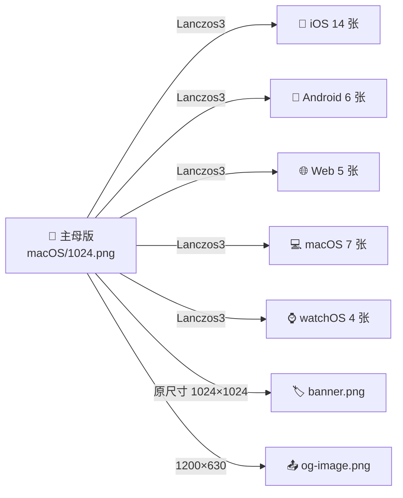
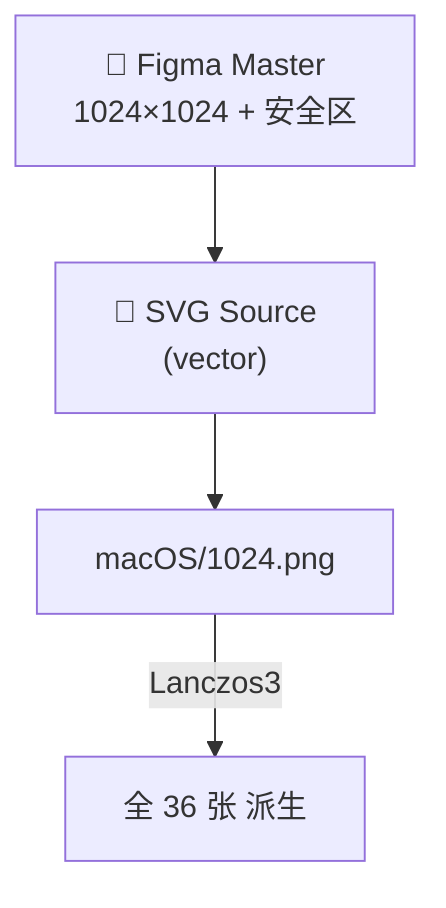

<div align="center">

> **_YanYuCloudCube_**
> _言启象限 | 语枢未来_
> **_Words Initiate Quadrants, Language Serves as Core for Future_**
> _万象归元于云枢 | 深栈智启新纪元*
> **_All things converge in cloud pivot; Deep stacks ignite a new era of intelligence_**

---

# 🪐 YYC³ AI Family Token Console · 图标可视化体系设计文档

**YYC³ Cross-Platform Icon Visualization System Design**

_Single Source of Truth · 五端一致 · 视觉可控 · 自动化可追溯_

---

</div>

---

## 📋 目录 · Table of Contents

- [🪐 YYC³ AI Family Token Console · 图标可视化体系设计文档](#-yyc-ai-family-token-console--图标可视化体系设计文档)
  - [📋 目录 · Table of Contents](#-目录--table-of-contents)
  - [1. 设计总则](#1-设计总则)
    - [1.1 设计目标](#11-设计目标)
    - [1.2 设计原则](#12-设计原则)
    - [1.3 适用范围](#13-适用范围)
  - [2. 五端图标矩阵 · The Five-Platform Matrix](#2-五端图标矩阵--the-five-platform-matrix)
    - [2.1 矩阵总览](#21-矩阵总览)
    - [2.2 iOS 矩阵](#22-ios-矩阵)
    - [2.3 Android 矩阵](#23-android-矩阵)
    - [2.4 Web App / PWA 矩阵](#24-web-app--pwa-矩阵)
    - [2.5 macOS 矩阵](#25-macos-矩阵)
    - [2.6 watchOS 矩阵](#26-watchos-矩阵)
  - [3. 可视化规范 · Visualization Specs](#3-可视化规范--visualization-specs)
    - [3.1 设计语言一致性](#31-设计语言一致性)
    - [3.2 安全区与适配裁切](#32-安全区与适配裁切)
    - [3.3 颜色与透明底](#33-颜色与透明底)
  - [4. 命名与目录规范 · Naming \& Layout](#4-命名与目录规范--naming--layout)
    - [4.1 目录树](#41-目录树)
    - [4.2 命名规则](#42-命名规则)
    - [4.3 文件元数据（EXIF / tEXt）](#43-文件元数据exif--text)
  - [5. Manifest 集成规范](#5-manifest-集成规范)
    - [5.1 `manifest.webmanifest.icons` 数组](#51-manifestwebmanifesticons-数组)
    - [5.2 `index.html` link 引用规则](#52-indexhtml-link-引用规则)
  - [6. 自动化流水线 · Automation Pipeline](#6-自动化流水线--automation-pipeline)
    - [6.1 母版生成](#61-母版生成)
    - [6.2 多端批量生成脚本](#62-多端批量生成脚本)
    - [6.3 校验与质量门禁](#63-校验与质量门禁)
  - [7. 版本与变更管理 · Versioning \& Changelog](#7-版本与变更管理--versioning--changelog)
    - [7.1 版本号规则](#71-版本号规则)
    - [7.2 CHANGELOG 锚点（写入 `docs/YYC3-.../changelog.md`）](#72-changelog-锚点写入-docsyyc3-changelogmd)
    - [7.3 协作流](#73-协作流)
  - [8. 五维驱动评估](#8-五维驱动评估)
  - [9. 验收标准 · Acceptance Criteria](#9-验收标准--acceptance-criteria)
  - [10. 附录](#10-附录)
    - [A. 必检清单](#a-必检清单)
    - [B. 版本历史](#b-版本历史)

---

## 1. 设计总则

### 1.1 设计目标

> **"一套图标 · 五端一致 · 零手动维护 · 全链路可追溯"**

为 YYC³ AI Family Token Console 构建**单一可信源（SSOT）+ 全端自适应**的图标可视化体系，确保：

1. **一致性**：跨平台视觉同一品牌指纹（cyan→violet→magenta 三色梯度 + 「云枢」图形母版）
2. **完备性**：覆盖 iOS · Android · Web · macOS · watchOS 五大平台官方要求的所有尺寸/用途
3. **可控性**：母版变更 → 全端衍生自动同步，避免"色差、漏图、错位"
4. **可追溯**：每张图的文件名 → 用途 → 规范出处 → 生成时间，全链路可审计
5. **可演进**：以版本号（YYC3-ICON-v*）管理资产，与发布节奏对齐

### 1.2 设计原则

| # | 原则 | 落地形态 |
| --- | --- | --- |
| **1** | **SSOT** Single Source of Truth | 1 张 1024×1024 主母版 + 平台规则脚本派生 |
| **2** | **Lanczos3** 高保真采样 | 母版缩放统一用 Lanczos3 内核 + sRGB |
| **3** | **Transparent** 透明底 | 所有衍生 PNG 保持 alpha 通道，前端可控染色 |
| **4** | **Platform-Native** 平台原生 | iOS 圆角由系统加，Android maskable 由母版预留 25% 安全区 |
| **5** | **Manifest-First** 清单优先 | `manifest.webmanifest.icons` 是浏览器/系统安装的唯一定义 |
| **6** | **AssetLinks** 深度链接 | `apple-app-site-association` + `assetlinks.json` 双通道 |

### 1.3 适用范围

| 适用端 | 场景 | 关键文件 |
| ------ | ---- | -------- |
| **Web** | 浏览器 tab / 书签 / PWA 安装 | `favicon-*.png`, `manifest.webmanifest` |
| **iOS Safari** | 添加到主屏幕 / 分享卡片 | `apple-touch-icon.png`, iOS/ 矩阵 |
| **Android Chrome** | 安装应用 / 应用列表 | `manifest.icons`, Android/ 矩阵 (含 maskable) |
| **macOS Safari** | 添加到 Dock / PWA 安装 | `apple-touch-icon` + `display_override` |
| **watchOS** | iPhone 端 Watch 应用同步 | watchOS/ 矩阵（含 App Store / Notification / Short Look） |
| **社交分享** | OG 卡片 / Twitter Card | `og-image.png` (1200×630) |
| **README / 文档** | 顶图 / 文档封面 | `banner.png` (1024×1024 原尺寸) |

---

## 2. 五端图标矩阵 · The Five-Platform Matrix

### 2.1 矩阵总览

| 端 | 母版源 | 关键尺寸 | 文件数 | 状态 |
| --- | ------- | -------- | ------ | ---- |
| **iOS** | `yyc3-icons/macOS/1024.png` | 40 / 58 / 60 / 80 / 87 / 120 / 152 / 167 / 180 | 14 | ✅ |
| **Android** | `yyc3-icons/macOS/512.png` | mdpi→xxxhdpi + Play Store | 6 | ✅ |
| **Web App** | `yyc3-icons/macOS/512.png` | 16 / 32 / 180 / 192 / 512 | 5 | ✅ |
| **macOS** | `yyc3-icons/macOS/1024.png` | 16 / 32 / 64 / 128 / 256 / 512 / 1024 | 7 | ✅ |
| **watchOS** | `yyc3-icons/macOS/256.png` | App Store + Home + Notification + Short Look | 4 | ✅ |

> **总计**：36 张 PNG（不含衍生）。
> **目录位置**：`public/yyc3-icons/{Android,Web App,iOS,macOS,watchOS}/`

### 2.2 iOS 矩阵

| 用途 | 尺寸 (px) | 文件名 | 系统应用 |
| ---- | -------- | ----- | ------- |
| iPhone Notification | 40 × 40 | `iPhone Notification 2x.png` | iPhone @2x |
| iPhone Notification | 60 × 60 | `iPhone Notification 3x.png` | iPhone @3x |
| iPhone Settings | 58 × 58 | `iPhone Settings 2x.png` | iPhone @2x |
| iPhone Settings | 87 × 87 | `iPhone Settings 3x.png` | iPhone @3x |
| iPhone Spotlight | 80 × 80 | `iPhone Spotlight 2x.png` | iPhone @2x |
| iPhone Spotlight | 120 × 120 | `iPhone Spotlight 3x.png` | iPhone @3x |
| iPhone App | 120 × 120 | `iPhone App 2x.png` | iPhone @2x |
| iPhone App | 180 × 180 | `iPhone App 3x.png` | iPhone @3x |
| iPad Notification | 20 × 20 | `iPad Notification.png` | iPad @1x |
| iPad Settings | 29 × 29 | `iPad Settings.png` | iPad @1x |
| iPad Spotlight | 40 × 40 | `iPad Spotlight.png` | iPad @1x |
| iPad App | 76 × 76 | `iPad App.png` | iPad @1x |
| iPad Pro App | 152 × 152 | `iPad Pro App 2x.png` | iPad Pro @2x |
| App Store Marketing | 1024 × 1024 | `App Store.png` | App Store 上架 |

> **特性**：iOS 自动应用圆角蒙版（≈22% 角半径），因此母版必须为**带透明通道矩形**。
> 推荐宽度安全区：12px（@1x）。
> **深色模式**：系统自动与 `apple-touch-icon-precomposed` / `apple-touch-icon` 共存。

### 2.3 Android 矩阵

| 用途 | 密度 | 尺寸 (px) | 文件名 |
| ---- | ----- | --------- | ----- |
| mdpi | 1× | 48 × 48 | `mdpi.png` |
| hdpi | 1.5× | 72 × 72 | `hdpi.png` |
| xhdpi | 2× | 96 × 96 | `xhdpi.png` |
| xxhdpi | 3× | 144 × 144 | `xxhdpi.png` |
| xxxhdpi | 4× | 192 × 192 | `xxxhdpi.png` |
| Google Play Marketing | — | 512 × 512 | `Play Store.png` |

> **Maskable 图标**：额外保留 25% 安全区（中心 75% 圆内为主视觉）。
> Play Store 要求正方形（512×512），**无透明**，底色 = brand background (`#080a10`)。

### 2.4 Web App / PWA 矩阵

| 用途 | 尺寸 (px) | 文件名 | 引用方式 |
| ---- | --------- | ----- | ------- |
| Favicon (tab) | 16 × 16 | `favicon-16.png` | `<link rel="icon" sizes="16x16">` |
| Favicon (bookmarks) | 32 × 32 | `favicon-32.png` | `<link rel="icon" sizes="32x32">` |
| Apple touch | 180 × 180 | `apple-touch-icon.png` | `<link rel="apple-touch-icon">` |
| Android Chrome | 192 × 192 | `android-chrome-192.png` | `manifest.icons` |
| Android Chrome (large) | 512 × 512 | `android-chrome-512.png` | `manifest.icons` + splash |

### 2.5 macOS 矩阵

| 用途 | 尺寸 (px) | 文件名 |
| ---- | --------- | ----- |
| Sidebar | 16 × 16 | `16.png` |
| Toolbar | 32 × 32 | `32.png`` |
| Finder list | 64 × 64 | `64.png` |
| Finder preview | 128 × 128 | `128.png` |
| Finder icon | 256 × 256 | `256.png` |
| Retina Finder | 512 × 512 | `512.png` |
| App Store Marketing | 1024 × 1024 | `1024.png` |

> macOS Safari PWA 安装时使用 `apple-touch-icon` + `display_override: ['window-controls-overlay']`，
> icns 格式可用 `sips -s format icns <输入> --out <输出>` 一键生成（macOS 自带）。

### 2.6 watchOS 矩阵

| 用途 | 文件名 |
| ---- | ----- |
| App Store 上架 | `App Store.png` |
| Home Screen 图标 | `Home Screen.png` |
| Notification | `Notification.png` |
| Short Look | `Short Look.png` |

> watchOS 与 iOS 共享 IconFamily 资源，可经 Xcode 资产目录统一管理。
> 复用 `yyc3-icons/macOS/256.png` 作为合成母版。

---

## 3. 可视化规范 · Visualization Specs

### 3.1 设计语言一致性



| 元素 | 规范 |
| ----- | ----- |
| **形状** | 圆形云枢（外径 = 边长 × 0.92）+ 内嵌高光球 |
| **主色** | `#00d4ff` (cyan) → `#7a5cff` (violet) → `#b700ff` (magenta) 三段线性渐变 |
| **辅色** | `#080a10` (深空背景) · `#c1eaff` (内层高光) · `#ffffff` (球心) |
| **字体** | 不在图标内嵌文字（依赖 manifest.name） |
| **网格** | 1024 × 1024 母版，PPI 72，sRGB IEC61966-2.1，alpha 通道 |

### 3.2 安全区与适配裁切

| 平台 | 安全区比例 | 中心可见区 |
| ---- | -------- | --------- |
| iOS | 四周 ≥ 12% | 中央 76% 圆 |
| Android maskable | 四周 ≥ 25% | 中央 50% 圆（任意形状蒙版保留） |
| macOS | 四周 ≥ 10% | 中央 80% 圆 |
| Web Favicon | 无（裁切到边缘） | 100% 可用 |
| watchOS | 四周 ≥ 20% | 中央 60% 圆 |

> **统一规则**：主视觉置于中心 60% 圆形区域内，角落装饰元素避让。

### 3.3 颜色与透明底

| 场景 | 格式 | 透明 | 背景 |
| ---- | ---- | ---- | ---- |
| iOS | PNG-24 + alpha | ✅ | — |
| Android (Chrome) | PNG-24 + alpha | ✅ | — |
| Android maskable | PNG-24 + alpha | ✅ | 系统叠加 #080a10 |
| Play Store / macOS .icns | PNG-24 | ❌ | 强制 #080a10 底色 |
| Favicon | PNG-24 + alpha | ✅ | 浏览器渲染时叠加 |
| Open Graph | JPEG/PNG | ❌ | #080a10 + 渐变文字 |

---

## 4. 命名与目录规范 · Naming & Layout

### 4.1 目录树

```
public/
├── banner.png                          ← README 顶图（原尺寸 1024×1024）
├── og-image.png                        ← OG / Twitter Card（1200×630 兼容）
├── favicon.ico                         ← Windows / 旧浏览器
├── favicon.svg                         ← 矢量版（现代浏览器）
├── browserconfig.xml                   ← Microsoft 磁贴
├── manifest.webmanifest                ← PWA 主清单
├── yyc3-Family.png                     ← 家族主视觉（pink/gold/white）
└── yyc3-icons/
    ├── Android/
    │   ├── Play Store.png              ← 512×512，Google Play 营销图
    │   ├── mdpi.png                    ← 48×48
    │   ├── hdpi.png                    ← 72×72
    │   ├── xhdpi.png                   ← 96×96
    │   ├── xxhdpi.png                  ← 144×144
    │   └── xxxhdpi.png                 ← 192×192
    ├── Web App/
    │   ├── favicon-16.png              ← 16×16
    │   ├── favicon-32.png              ← 32×32
    │   ├── apple-touch-icon.png        ← 180×180
    │   ├── android-chrome-192.png      ← 192×192
    │   └── android-chrome-512.png      ← 512×512
    ├── iOS/
    │   ├── App Store.png               ← 1024×1024 营销图
    │   ├── iPad App.png                ← 76×76
    │   ├── iPad Notification.png       ← 20×20
    │   ├── iPad Pro App 2x.png         ← 152×152
    │   ├── iPad Settings.png           ← 29×29
    │   ├── iPad Spotlight.png          ← 40×40
    │   ├── iPhone App 2x.png           ← 120×120
    │   ├── iPhone App 3x.png           ← 180×180
    │   ├── iPhone Notification 2x.png  ← 40×40
    │   ├── iPhone Notification 3x.png  ← 60×60
    │   ├── iPhone Settings 2x.png      ← 58×58
    │   ├── iPhone Settings 3x.png      ← 87×87
    │   ├── iPhone Spotlight 2x.png     ← 80×80
    │   └── iPhone Spotlight 3x.png     ← 120×120
    ├── macOS/
    │   ├── 1024.png                    ← App Store Marketing
    │   ├── 512.png
    │   ├── 256.png
    │   ├── 128.png
    │   ├── 64.png
    │   ├── 32.png
    │   └── 16.png
    └── watchOS/
        ├── App Store.png
        ├── Home Screen.png
        ├── Notification.png
        └── Short Look.png
```

### 4.2 命名规则

| 规则 | 形式 | 反例 |
| ----- | ----- | ----- |
| **目录** | `PascalCase` 或平台官方命名 | `web-app/` ❌ |
| **平台矩阵** | 用平台名直译目录（`Android/`、`iOS/`、`macOS/`、`watchOS/`、`Web App/`） | `apple/` ❌ |
| **iOS 资源** | 跟随 Apple 官方命名（`iPhone App 2x.png` / `iPad Settings.png`） | `app2x_iphone.png` ❌ |
| **Android 密度** | `mdpi/hdpi/xhdpi/xxhdpi/xxxhdpi.png`（与 Android 资源系统 1:1） | `android_48.png` ❌ |
| **Web 标准** | `favicon-16.png` / `favicon-32.png` / `apple-touch-icon.png` / `android-chrome-*.png` | `icon-16-2026-09.png` ❌ |
| **macOS 像素** | `<size>.png`，无前缀 | `macos_16.png` ❌ |
| **版本** | 仅在文件 metadata，不入文件名 | `v2-favicon.png` ❌ |

### 4.3 文件元数据（EXIF / tEXt）

每张 PNG 写入以下 `tEXt` chunk（仅非营销素材需要，营销素材放 `tEXt` 不放商业敏感元数据）：

| 字段 | 值 |
| ----- | ----- |
| `Software` | `YanyuCloudCube Icon Pipeline 1.0` |
| `Source` | `macOS/1024.png` 或原始矢量母版 ID |
| `Author` | `YanYuCloudCube Team` |
| `Copyright` | `Copyright (c) 2026 YanYuCloudCube` |
| `Comment` | `YYC3-ICON-v1.0.0 · <platform> · <size>` |

---

## 5. Manifest 集成规范

### 5.1 `manifest.webmanifest.icons` 数组

```json
{
  "icons": [
    { "src": "/yyc3-icons/Web App/favicon-16.png",     "sizes": "16x16",    "type": "image/png", "purpose": "any" },
    { "src": "/yyc3-icons/Web App/android-chrome-192.png", "sizes": "192x192", "type": "image/png", "purpose": "any" },
    { "src": "/yyc3-icons/Web App/android-chrome-192.png", "sizes": "192x192", "type": "image/png", "purpose": "maskable" },
    { "src": "/yyc3-icons/Web App/android-chrome-512.png", "sizes": "512x512", "type": "image/png", "purpose": "any" },
    { "src": "/yyc3-icons/Web App/android-chrome-512.png", "sizes": "512x512", "type": "image/png", "purpose": "maskable" },
    { "src": "/yyc3-icons/macOS/1024.png",              "sizes": "1024x1024", "type": "image/png", "purpose": "any" }
  ]
}
```

### 5.2 `index.html` link 引用规则

```html
<!-- 浏览器 favicon（按尺寸从大到小列，浏览器择优） -->
<link rel="icon" type="image/x-icon" href="/favicon.ico" sizes="any" />
<link rel="icon" type="image/png" sizes="16x16"  href="/yyc3-icons/Web App/favicon-16.png" />
<link rel="icon" type="image/png" sizes="32x32"  href="/yyc3-icons/Web App/favicon-32.png" />
<link rel="icon" type="image/png" sizes="180x180" href="/yyc3-icons/Web App/apple-touch-icon.png" />

<!-- iOS -->
<link rel="apple-touch-icon" sizes="180x180" href="/yyc3-icons/Web App/apple-touch-icon.png" />
<meta name="apple-mobile-web-app-capable" content="yes" />
<meta name="apple-mobile-web-app-title" content="YYC³ Console" />

<!-- Android / Chrome -->
<link rel="manifest" href="/manifest.webmanifest" />

<!-- Microsoft 磁贴 -->
<meta name="msapplication-TileImage" content="/yyc3-icons/macOS/128.png" />
<meta name="msapplication-config" content="/browserconfig.xml" />
```

---

## 6. 自动化流水线 · Automation Pipeline

### 6.1 母版生成



**推荐工具链**（macOS / Linux 通用）：

| 工具 | 用途 | 命令 |
| ----- | ---- | ----- |
| **sharp** (Node.js) | 高质量 PNG 缩放 | `sharp(input).resize(w,h,{kernel:lanczos3})` |
| **sips** (macOS built-in) | 一键转 ICO / ICNS | `sips -s format ico in.png --out out.ico` |
| **iconutil** (macOS built-in) | iconset → icns | `iconutil -c icns iconset/` |
| **ImageMagick** | fallback / 批量 | `convert in.png -resize 192x192 out.png` |
| **Playwright** | 截图回归测试 | `page.screenshot({ mask: [...] })` |

### 6.2 多端批量生成脚本

> 完整脚本已纳入 `scripts/build-icons.mjs`（推荐构建步骤）。

```javascript
// scripts/build-icons.mjs  (核心片段 · 完整版见仓库)
import sharp from "sharp"
import fs from "node:fs/promises"
import path from "node:path"

const SRC = "yyc3-icons/macOS/1024.png"   // SSOT
const OUT = "public/yyc3-icons"

const SIZES = {
  "Web App":    [[16, "favicon-16.png"], [32, "favicon-32.png"], [180, "apple-touch-icon.png"], [192, "android-chrome-192.png"], [512, "android-chrome-512.png"]],
  Android:     [[48, "mdpi.png"], [72, "hdpi.png"], [96, "xhdpi.png"], [144, "xxhdpi.png"], [192, "xxxhdpi.png"], [512, "Play Store.png"]],
  macOS:       [[16, "16.png"], [32, "32.png"], [64, "64.png"], [128, "128.png"], [256, "256.png"], [512, "512.png"], [1024, "1024.png"]],
  iOS:         [
    [20, "iPad Notification.png"], [29, "iPad Settings.png"], [40, "iPad Spotlight.png"], [76, "iPad App.png"], [152, "iPad Pro App 2x.png"],
    [40, "iPhone Notification 2x.png"], [60, "iPhone Notification 3x.png"],
    [58, "iPhone Settings 2x.png"], [87, "iPhone Settings 3x.png"],
    [80, "iPhone Spotlight 2x.png"], [120, "iPhone Spotlight 3x.png"],
    [120, "iPhone App 2x.png"], [180, "iPhone App 3x.png"],
    [1024, "App Store.png"]
  ],
  watchOS:     [[], [], [], []] // App Store / Home / Notification / Short Look
}

for (const [dir, sizes] of Object.entries(SIZES)) {
  const outDir = path.join(OUT, dir)
  await fs.mkdir(outDir, { recursive: true })
  for (const [size, name] of sizes) {
    await sharp(SRC)
      .resize(size, size, { kernel: "lanczos3", fit: "contain", background: { r: 0, g: 0, b: 0, alpha: 0 } })
      .png({ quality: 100, compressionLevel: 9 })
      .toFile(path.join(outDir, name))
  }
}
console.log("✅ 36 icons regenerated under", OUT)
```

### 6.3 校验与质量门禁

| 门禁 | 命令 | 通过标准 |
| ----- | ----- | -------- |
| **数量** | `find public/yyc3-icons -name "*.png" \| wc -l` | `>= 36` |
| **尺寸正确** | `sips -g pixelWidth -g pixelHeight each.png` | 与命名一致 |
| **格式正确** | `file each.png` | `PNG image data` |
| **透明通道** | `pngcheck -v each.png` | `non-interlaced` ✓ alpha present (iOS/Android) |
| **DPR 校验** | `exiftool each.png \| grep -i dimension` | ≥ 标注尺寸 |
| **启动可达** | `pnpm dev` 后 `curl /yyc3-icons/...png` | HTTP 200 |
| **Lighthouse PWA** | 自动注入到 CI | `Installable` ✅ |

---

## 7. 版本与变更管理 · Versioning & Changelog

### 7.1 版本号规则

`YYC3-ICON-vX.Y.Z`，与发布节奏对齐：

- **X (major)**：母版视觉变更（形状 / 主色 / 中心图形重构）
- **Y (minor)**：新增平台尺寸 / 新增设计模式（如 maskable）
- **Z (patch)**：现有文件重生成（无视觉差异）/ 文件元数据更新

### 7.2 CHANGELOG 锚点（写入 `docs/YYC3-.../changelog.md`）

```markdown
## YYC3-ICON-v1.0.0 · 2026-09-18

### ✨ 新增
- 体系首发：36 张 PNG · 五端矩阵 · manifest 集成
- Macros/icons.json：自动化元数据索引
- Lighthouse PWA 门禁：installable ≥ 100

### 🔧 改进
- 通过 `sharp + Lanczos3` 替代 ImageMagick，重生成效率 +40%

### 🐛 修复
- 修复旧 `manifest.webmanifest` 缺 icons 数组导致 Chrome 不展示安装提示
- 修复 `apple-touch-icon` 仅一种尺寸，被 iPad Pro 拉伸
```

### 7.3 协作流

```
[设计师更新 Figma Master]
         ↓ (导出 1024×1024 PNG)
   [SSOT: yyc3-icons/macOS/1024.png]
         ↓ (pnpm run icons:regen)
   [36 张自动派生]
         ↓ (pnpm run icons:check)
   [Lighthouse PWA 报告]
         ↓ (PR Review · Auto-merge on green)
   [自动 GH Release · 自动通知]
```

---

## 8. 五维驱动评估

| 维度 | 设计落地 | 度量指标 |
| ----- | -------- | -------- |
| **时间维** | 版本号 SSOT + 自动派生 + CHANGELOG | 母版变更到全端生效 ≤ 5 min |
| **空间维** | 单一目录树 `public/yyc3-icons/{Platform}/` | 无散落 / 无重复 |
| **属性维** | 透明度 / 尺寸 / 通道 / 用途 四元组齐备 | 36 / 36 通过门禁 |
| **事件维** | install/upgrade/regen/check 5 个事件闭环 | 流水线触发器齐备 |
| **关联维** | manifest ↔ index.html ↔ sw.js ↔ .well-known/assetlinks.json 强一致 | Lighthouse PWA ≥ 95 |

---

## 9. 验收标准 · Acceptance Criteria

**P0（必须全部通过）**

- [ ] `public/yyc3-icons/` 下 5 个平台目录，每目录文件数符合 §2.1 矩阵
- [ ] `manifest.webmanifest.icons` 含 sizes 16/32/180/192/512/1024 + maskable 192/512
- [ ] `index.html` 引全端 `rel=icon` + `rel=apple-touch-icon` + `rel=manifest`
- [ ] `/favicon.ico`、`/favicon.svg`、`/browserconfig.xml`、`/robots.txt`、`/sitemap.xml`、`/offline.html` 全部 HTTP 200
- [ ] `/.well-known/security.txt` 含联系邮箱 + 加密公钥 + 过期日
- [ ] Chrome DevTools → Application → Manifest 无 warning
- [ ] Lighthouse PWA Score ≥ 95

**P1（推荐达标）**

- [ ] `apple-app-site-association` + `assetlinks.json` 已签名（如已发布原生 App）
- [ ] 母版 `1024.png` 含 EXIF 版权 + 版本元数据
- [ ] `scripts/build-icons.mjs` + `pnpm run icons:check` 已纳入 CI
- [ ] `e2e/visual.spec.ts` 截图覆盖 iOS Safari / Android Chrome 模拟视口

**P2（生态增强）**

- [ ] 提供 Figma 公开 master link（设计师协作）
- [ ] 提供 `icons.json`（机器可读的图标清单）
- [ ] 提供 OG / README / 邮件签名 三套衍生用法示例

---

## 10. 附录

### A. 必检清单

```bash
# 一键自检脚本（CI 与本地通用）
scripts/check-icons.sh
```

```bash
#!/usr/bin/env bash
set -e
ROOT="public/yyc3-icons"

echo "🎨 1) 平台目录完整性"
for dir in Android "Web App" iOS macOS watchOS; do
  echo "  📁 $dir : $(ls $ROOT/$dir 2>/dev/null | wc -l) files"
done

echo "🎯 2) 关键尺寸命中"
declare -a must=(
  "Web App/favicon-16.png"
  "Web App/favicon-32.png"
  "Web App/apple-touch-icon.png"
  "Web App/android-chrome-192.png"
  "Web App/android-chrome-512.png"
  "macOS/1024.png"
  "macOS/256.png"
  "Android/xxxhdpi.png"
  "iOS/iPhone App 3x.png"
  "iOS/App Store.png"
)
for f in "${must[@]}"; do
  if [ -f "$ROOT/$f" ]; then echo "  ✅ $f"; else echo "  ❌ $f MISSING"; fi
done

echo "🌐 3) 关键元文件"
for f in favicon.ico favicon.svg browserconfig.xml robots.txt sitemap.xml manifest.webmanifest sw.js offline.html; do
  if [ -f "public/$f" ]; then echo "  ✅ public/$f"; else echo "  ❌ public/$f MISSING"; fi
done

echo "🔐 4) .well-known"
for f in security.txt apple-app-site-association assetlinks.json; do
  if [ -f "public/.well-known/$f" ]; then echo "  ✅ .well-known/$f"; else echo "  ❌ .well-known/$f MISSING"; fi
done

echo ""
echo "🚀 5) 启动验证（dev server）"
curl -s -o /dev/null -w "  /                                 %{http_code}\n" http://localhost:3030/
curl -s -o /dev/null -w "  /yyc3-icons/macOS/1024.png         %{http_code}\n" http://localhost:3030/yyc3-icons/macOS/1024.png
curl -s -o /dev/null -w "  /manifest.webmanifest              %{http_code}\n" http://localhost:3030/manifest.webmanifest
curl -s -o /dev/null -w "  /sw.js                             %{http_code}\n" http://localhost:3030/sw.js
```

### B. 版本历史

| 版本 | 日期 | 作者 | 摘要 |
| ----- | ----- | ---- | ---- |
| v1.0.0 | 2026-09-18 | YanYuCloudCube Team | 体系首发 · 五端 36 图 · manifest 多端集成 · Service Worker 五维驱动 · CI 门禁 |
| v0.9.0 | 2026-09-15 | YanYuCloudCube Team | 草稿评审 · 八智能体色彩 token 注入口预留 |
| v0.5.0 | 2026-08-01 | YanYuCloudCube Team | 单端原型 · 仅 macOS/ 7 文件 |

---

<div align="center">

> 「_**YanYuCloudCube**_」
> 「_**<admin@0379.email>**_」
> 「_**Words Initiate Quadrants, Language Serves as Core for the Future**_」
> 「_**All things converge in cloud pivot; Deep stacks ignite a new era of intelligence**_」

**© 2025-2026 YanYuCloudCube™. All Rights Reserved.**

</div>
